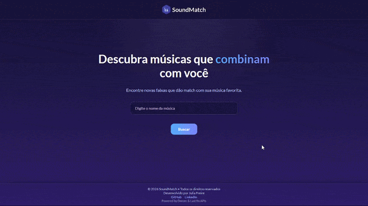

# 🎧 SoundMatch

SoundMatch é uma aplicação web desenvolvida em Angular que recomenda músicas similares a partir de uma faixa informada pelo usuário.

A aplicação utiliza APIs externas para gerar recomendações inteligentes e reproduzir previews das músicas em um player customizado.

---

## 📸 Preview

<p align="center">
  
</p>

---

## 🚀 Funcionalidades

- Busca de músicas pelo nome  
- Recomendação automática de músicas similares  
- Botão "Recomendar outra" sem nova busca  
- Player de áudio customizado (play, pause, progresso)  
- Controle de reprodução (apenas um player por vez)  
- UI moderna com foco em experiência do usuário  

---

## 🧠 Como funciona

1. O usuário digita o nome de uma música  
2. A aplicação busca a faixa na API do Deezer  
3. O sistema utiliza o Last.fm para encontrar músicas similares  
4. Caso não encontre, utiliza fallback com músicas do mesmo artista  
5. A recomendação é exibida com preview e capa  

---

## 🛠️ Tecnologias utilizadas

- Angular  
- TypeScript  
- HTML5 & CSS3  

### APIs:
- Deezer API  
- Last.fm API  

---

## 🎨 Design

- Interface moderna  
- Componentização com Angular  
- Layout pensado para desktop e mobile  
- Feedback visual com animações e estados de loading  

---

## ▶️ Como executar o projeto

```bash
npm install
ng serve -o
```

---

## ⚠️ Observações

- Algumas músicas podem não possuir preview disponível  
- O Last.fm pode apresentar limitações com músicas brasileiras (como sertanejo e samba)  
- Foi implementado um fallback utilizando o Deezer para melhorar a qualidade das recomendações  
- Nesses casos, são recomendadas outras músicas do mesmo artista 

---

## 👩‍💻 Autor

**Julia Freire**

- GitHub: https://github.com/juuhfrdev  
- LinkedIn: https://www.linkedin.com/in/julia-freire-de-souza/  

---

## 💡 Melhorias futuras

- Melhorar o algoritmo de recomendação  
- Adicionar sistema de favoritos  
- Adicionar sistema de integração direta com plataformas de áudio
- Integração com novas APIs de música  
- Melhorar ainda mais a experiência so usuário 

---

## 🌐 Demo
Acesse em:

https://juuhfrdev.github.io/SoundMatch/
